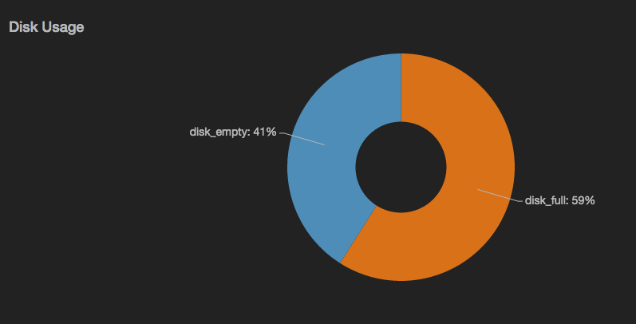
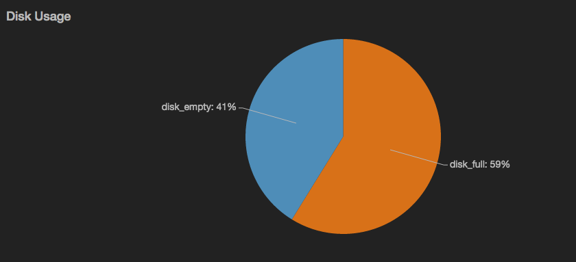

piechart
========

Render data as a pie or donut chart.



```
view piechart -o {
   categoryField: 'fieldname',
   id: 'string',
   title: 'string',
   valueField: 'fieldname',
   radiusInner: n,
   sliceLabels: {
     nameField: fieldname',
     valueField: 'fieldname',
     valueFormat: 'd3FormatString'
   }
}
```

*or*

```
view piechart -categoryField 'fieldname' -id 'string' -title 'string' -valueField 'fieldname' -messageField 'fieldname' -sliceLabels.nameField 'auto'|'fieldname' -sliceLabels.valueField 'auto'|'fieldname' -sliceLabels.valueFormat 'auto'|'d3FormatString' -radiusInner n
```

See [Defining sink parameters](../index.md#defining-view-parameters) for an explanation of how sink parameters can be expressed as object literals.

Parameter  |  Description  |  Required?
---------- | ------------- | ---------:
`-categoryField` |  The name of the field to use as the category accessor. Categories are displayed in the order in which they appear in the data stream, clockwise.  |  Yes
`-id`  |  An identifier for this sink that serves as a handle for referencing the object in Juttle syntax; conceptually identical to a variable name  | No
`-title`  |  The title for the user-visible output, if it has one; the value may be any valid Juttle expression that produces a string  |  No; defaults to the name field that is present in all metrics points
`-valueField`  |  The name of the field to use as the source for the numeric values  |  No; defaults to the `value` field that is present in all metrics points. If no value field is present, the first numeric field in the stream is used.
`-radiusInner`  |  Optionally, you can use this parameter to display the pie chart as a wheel with an inner radius specified in pixels  |  No; default is 0
`-sliceLabels.nameField`  |  The field containing an alternative name label for each slice  |  No; default is the value of `-categoryField`
`-sliceLabels.valueField` | The field containing an alternative value label for each slice | No; default is the value of `-valueField`
`-sliceLabels.valueFormat`  |  The format for the value label, using the [d3 number formatting syntax](https://github.com/mbostock/d3/wiki/Formatting)  |  No; default is `.2f`

_Example: Render a simple donut chart showing disk utilization_ 

```
{!docs/examples/charts/piechart.juttle!}
```



