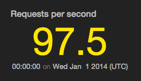
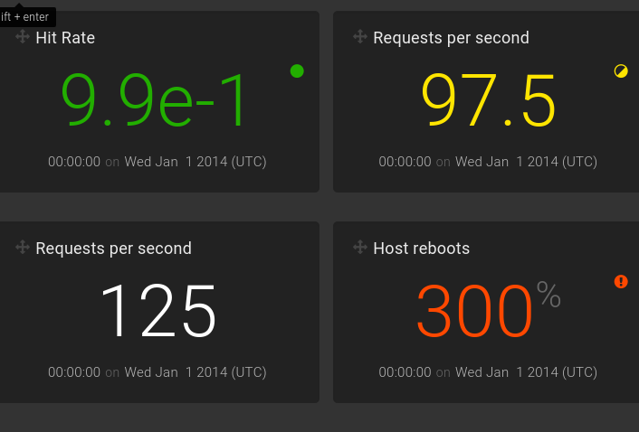
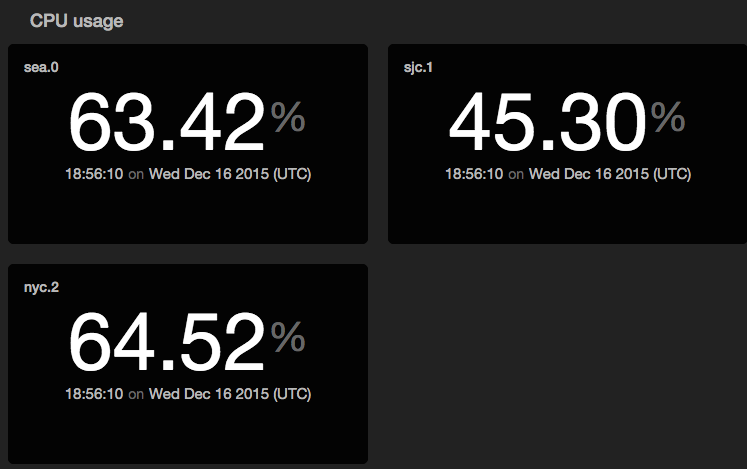

tile
====

Render a metric tile displaying exactly one value; can be faceted.



```
view tile -o {
  id: 'string'
  title: 'string'
  levelField: 'fieldname',
  valueField: 'fieldname',
  valueFormat: 'd3FormatString',
  timeField: 'fieldname',
  facetFields: ['field1', 'field2'...]
}
```

*or*
```
view tile -id 'string' -title 'string'
  -levelField 'fieldname' -valueField 'fieldname'
  -valueFormat 'd3FormatString' -timeField 'fieldname'
  -facetFields ['field1', 'field2'...]
```

See [Defining sink parameters](../index.md#defining-view-parameters)
for an explanation of how sink parameters can be expressed as object literals.

Parameter  |  Description  |  Required?
---------- | ------------- | ---------:
`-id`  |  An identifier for this sink that serves as a handle for referencing the object in Juttle syntax; conceptually identical to a variable name   |  No
`-title`  |  The title for the user-visible output, if it has one; the value may be any valid Juttle expression that produces a string  |  No; defaults to the name field that is present in all metrics points
`-levelField`  |  The name of a field whose value is one of the following: <ul><li>error <p>Display this tile in red text with an alert icon. </p></li><li>warning <p>Display this tile in yellow text with a warning icon. </p></li><li>success <p>Display this tile in green text with a success icon. </p></li></ul> |  No; the default display is white text with no icon
`-valueField`  | The name of the field to use as the source for the numeric values  |  No; defaults to the `value` field that is present in all metrics points. If no value field is present, the first numeric field in the stream is used.
`-valueFormat`  |  The format for the tile value, using the [d3 number formatting syntax](https://github.com/mbostock/d3/wiki/Formatting)  |  No
`-timeField`  |  The field containing the time stamp  |  No; defaults to the time field
`-facetFields`  |  A comma-separated list of the fields on which facets are based  |  Required to enable faceting; omit this option to disable facets

_Example: Simple metric tiles showing data import successes and failures_

```
{!docs/examples/charts/tile_plain.juttle!}
```


_Example: Render four metric tiles color coded for different levels_ 

```
{!docs/examples/charts/tile_levels.juttle!}
```



_Example: Display a faceted tile chart_

```
{!docs/examples/charts/tile_faceted.juttle!}
```


