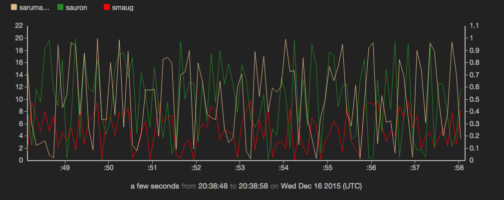

Creating a dual-axis time chart 
===============================

A time chart can have one Y axis or two. A dual-axis time chart is a
multi-series time chart in which some of the series have a different Y
scale than the others.

1.  In your @[timechart](../charts/timechart.md),
    use the `yScales.primary.*` and `yScales.secondary.*` parameters
    to configure the two Y scales.  
    
    One must include displayOnAxis: 'right'.

2.  Use the `series.yScale` parameter to configure
    the data series that belong to the secondary Y scale.

    Since primary is the default value, you only need to specify this
    parameter for the series that belong to the secondary scale.

_Example: Create a time chart in which the 'saruman' series uses the right-hand Y axis and all others use the left-hand Y axis_

```
{!docs/examples/charts/timechart_multi_series_1.juttle!}
```



