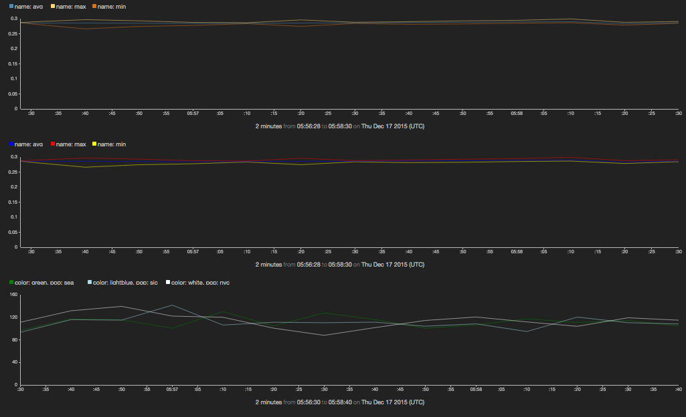

Multi-series time charts 
========================

A multi-series time chart displays multiple time series that share the
same scales for both the horizontal (time) and vertical (value) axes.

For charts that display multiple time series, there are two different
ways to structure data:

-   By the values of different fields inside individual points
-   By referring to a single field, distinguished by the value of
    another field

Both styles produce identical-looking charts. The style you choose
depends on how data is naturally organized in your Juttle program.

The series on a multi-series chart are displayed in distinctive colors
by default, but the colors may also be specified explicitly.  

For a multi-series chart using field names, the `-colors` parameter gives a comma-separated list of colors (that must be the same length as the `-columns` list), using any valid CSS color.  

For a chart using the `-by` parameter, the `-colorField` parameter specifies a field in which the color may be found. See [timechart](../charts/timechart.md)
for complete information about parameters.

_Example: configuring colors for time series_

```
{!docs/examples/charts/timechart_multi_series_1.juttle!}
```


_Example: another method for configuring colors for time series_

```
{!docs/examples/charts/timechart_multi_series_2.juttle!}
```



