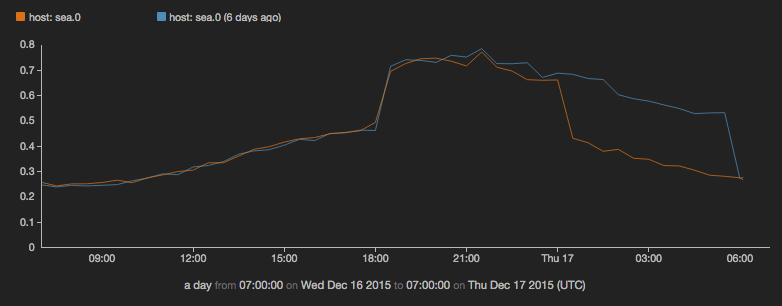

[TOC]

Overlaying events on time charts
================================

The [events](events.md)
output can be overlaid on a
[timechart](timechart.md)
to produce a single visual output. You can imagine the resulting
visualization as having two layers.

Chart overlays must observe the following rules:

-   Only charts with the same X axis may be overlaid.
-   The top or overlaid chart will create a second Y axis on right hand
    side of chart.
-   Only the title of the bottom chart will display; the title parameter
    of the top chart will be ignored.

1.  Create two flows: one that ends with
    view [events](events.md)
    and one that ends with
    view [timechart](timechart.md).
2.  Give an `-id` parameter to your view timechart, with any arbitrary string as
    its value.

    All [visual outputs](../index.md)
    accept an `-id` parameter, but currently only view timechart supports overlays.

3.  Give an `-on` parameter to the events view, with the value of your time chart's ID.

_Example: Overlay two series of "git merge" events on a timechart showing CPU load_

```
{!docs/examples/charts/events_on_timechart.juttle!}
```


***

Comparing data from different intervals
=======================================

Sometimes you want to compare data from different time periods by
overlaying them in one time chart.

For example, imagine you want to see November's daily online store
purchases compared to December's in order to see how they're affected by
the Christmas holiday. You can do this with the
[-duration](../charts/timechart.md#timechart__duration)
and
[-overlayTime](../charts/timechart.md#timechart__sink_overlaytime)
parameters.

You can see this feature illustrated in the examples below.

_Example: Compare yesterday's CPU usage with usage today so far_

```
{!docs/examples/charts/timechart_time_overlay_1.juttle!}
```


_Example: Compare CPU usage from today with the same day last week_

```
{!docs/examples/charts/timechart_time_overlay_2.juttle!}
```


